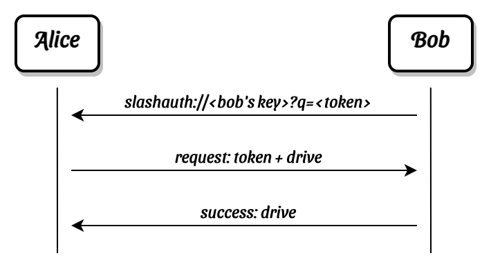
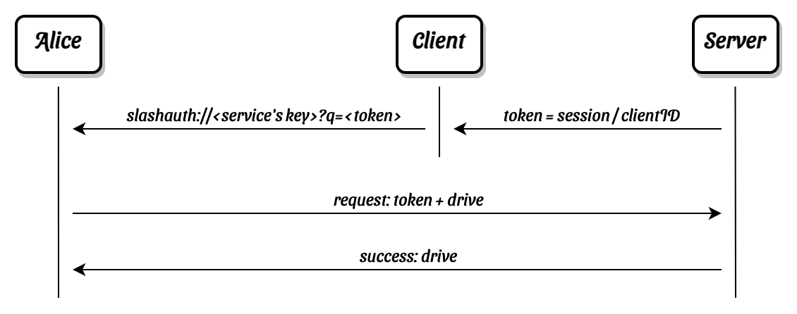

# SlashAuth

SlashAuth is a Slashtags [protocol](../slashtag/README.md#slashprotocol) for authenticating over a Slashtags connection.

Once authentication is done both sides share a private encrypted [drives](../drive) dedicated to each other, and can exchange data over, as an asynchronous communication channel.

## Install

```bash
npm i @synonymdev/slashtag @synonymdev/slashauth
```

## Usage

### Initiator's side

```javascript
import { Slashtag } from '@synonymdev/slashtag';
import { SlashAuth } from '@synonymdev/slashauth';

const initiator = new Slashtag({
  keyPair: Slashtag.createKeyPair(),
  protocols: { SlashAuth },
});
// Responder's wallet will have access to the initiator's profile
await initiator.setProfile({ name: 'Alice' });
// Access the protocol instance from anywhere in the application
const auth = slashtag.protocol(SlashAuth);

// After getting the slashauth:// url from the Responder,
// you can use it to read the Responder's profile
const responder = sdk.slashtag({ url: slashauthURL });
// Get the server's profile if it exists, so you can ask
// user for confirmation to authenticate to that Responder
const profile = await serverSlashtag.getProfile();

auth.once('error', errorHandler);

// On success, Initiator will get the details of the Drive that
// the Responder created for the Initiator
auth.once('success', ({ drive }) => {
  // Success handler
});

// Connect to the server and send the token in the url `?q=<token>`
auth.request(url);
```

### Responder's side

```javascript
import { Slashtag } from '@synonymdev/slashtag';
import { SlashAuth } from '@synonymdev/slashauth';

const responder = new Slashtag({
  keyPair: Slashtag.createKeyPair(),
  protocols: { SlashAuth },
});
// Initiator's wallet will have access to the Responder's profile
await responder.setProfile({ name: 'Bob' });
const auth = slashtag.protocol(SlashAuth);

auth.on('request', async ({ token, peerInfo, drive }, response) => {
  // Try resolving user's profile from their Slashtag
  const initiator = request.peerInfo.slashtag;

  // The Responder can send either a success or error message
  try {
    authorize(request.token, initiator);
    response.success();
  } catch (e) {
    response.error(e.message);
  }
});

// Listen on the Slashtag.key
await slashtag.listen();

function authorize(token, initiator) {
  // Check the token against server's sessions, clientIDs, etc.
  // Check if the user is already registered, blocked, etc.
}

// Generate a slashauth:// url and pass it to the initiator
// token can be a random string, or a session token or a clientID, etc.
SlashAuth.formatURL(slashtag.url, token);
```

## How it works

Before any of the SlashAuth's messages are exchanged, the Initiator and Responder are already connected over a secure connection using [Noise Protocol](https://noiseprotocol.org/).

More about Slashtags connections [here](#await-slashtaglisten).

So both the Initiator's and Responder's keys are already known and all subsequent communication is trusted.

This protocol adds two features:

1. The Initiator can pass a session token to the Responder.
2. Both the Initiator and the Responder creates a dedicated [drive](../drive/) for each other. Enabling further asynchronous communication between both parties.

### Examples

**Contacts**

Initiator 'Alice' wants to establish a connection to Responder 'Bob'.

- Bob creates a url with the protocol `slashauth:`, Bob's base32 encoding publicKey, and a unique token for this session.
- Alice connects to Bob using the Bob's publicKey parsed from the url, and pass the token, as well as the publicKey and encryptionKey to the drive created by Alice for Bob.
- If Bob accepts the request, Bob creates a drive dedicated for Alice, and sends it back to Alice.
- If Bob rejects the request, Bob can send an error message to Alice.

Once the request is accepted, now both Alice and Bob add each other as contacts, with drives for Incoming and Outgoing asynchronous messages.



**Login & Registration**

- Initiator 'Alice' visits a website, which can be a login page, or a 3rd party client.
- The client formats a url from the Server's publicKey, and a unique token to that client, whether that is a session token or a clientID, etc. That is left to the each application to decide.
- Alice connects to the server using its publicKey, and passes the token, and the dedicated drive.
- If the Server accepts the request, Alice will now get the details of the Server's drive, and the Client will have be authenticated to request resources from the Server.


